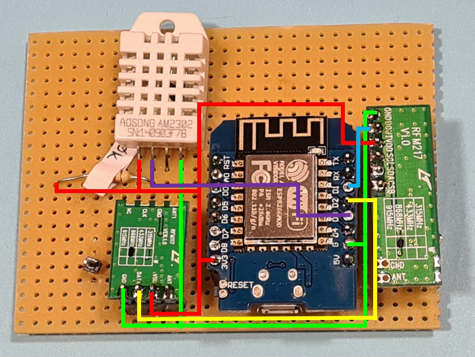

# ComputhermQRF component for ESPHome

## About
This external component provides a way retrieve and control Computherm Q series thermostats. The RF receiver allows up to four individual devices. Existing devices can either be monitored as sensors or via manual pairing (in progress) you can add virtual zones that control the boiler separately.
[Computherm Q8](https://computherm.info/en/digital_thermostats/computherm_q8rf)

The communication with the RF receiver is accomplised via 868.35 MHz in a custom protocol originally decoded by @denxhun in his [Arduino library](https://github.com/denxhun/ComputhermRF) and proposal of the reference hardware.
Inspiration came from [flogi diyiot blog](https://flogi-diyiot.blog.hu/2021/10/13/rf868mhz_wifi_gateway_esp8266_rfm217w_rfm119w_computherm_q8rf).

Bunding into ESPHome was inspired by @nistvan86 in his [CC1101 hardware alternative](https://github.com/nistvan86/esphome-q7rf).

## Configuration
Communication with the device is done through a receiver and an transmitter module. They are not connected, so theoretically sensor and switch module works independently. 

```yaml
# Example configuration entry

external_components:
  - source: github://afarago/esphome_component_computhermqrf
    components: [ computhermqrf ]

computhermqrf:
  receiver_pin: D1
  transmitter_pin: D2

binary_sensor:
  - platform: computhermqrf
    name: "Zone 1"
    code: 0x12347
  - platform: computhermqrf
    name: "Zone 2"
    code: 0x1234B

switch:
  - platform: computhermqrf
    name: "Zone 3"
    code: 0x12343

button:
  - platform: computhermqrf
    mode: "pair"
    name: "Start pairing"

```

## Configuration variables

### ComputhermQRF platform:
- **receiver_pin** (*Optional*): Specify the receiver pin.
- **transmitter_pin** (*Optional*): Specify the transmitter pin.

### Binary Sensor - Computherm thermostat modules
- **code** (*Required*, string): Specify the 5 digit hex code associated with the zone.
- **name** (*Optional*, string): Specify the zone name.
- All other options from [Binary Sensor](https://esphome.io/components/binary_sensor/index.html#config-binary_sensor).

### Switch - Virtual Zones
- **code** (*Required*, string): Specify the 5 digit hex code associated with the zone.
- **name** (*Optional*, string): Specify the zone name.
- **turn_on_watchdog_interval** (*Optional*, [Time](https://esphome.io/guides/configuration-types.html#config-time)): Specify how long the switch can stay turned on after the last write_state call arrived for the switch component in milliseconds. This can be used for example in conjunction with the keep_alive setting of Home Assistant's generic thermostat component to add an additional safe guard against the crash of HA and to prevent excessive heating costs. 
Defaults to 30 minutes.
- **resend_interval** (*Optional*, [Time](https://esphome.io/guides/configuration-types.html#config-time)): Specify how often to repeat the last state in milliseconds. Since this is a simplex protocol, there's no response arriving from the receiver and we need to compensate for corrupt or lost messages by repeating them. 
Defaults to 1 minute.
- All other options from [Switch](https://esphome.io/components/switch/index.html#config-switch).

### Button - Pairing 
- **mode** (*Required*, string): must be "pair"
- All other options from [Button](https://esphome.io/components/button/index.html#config-button).

Special pairing button and service to add a new virtual zone with details [below](#pairing-a-new-virtual-zone).

### Warning: Auto turn off switch
While hardware thermostats will turn off heating by periodically monitoring the temperature the virtual appliance will not do so, therefore it is advised to to create and automation to turn it off automatically after a period of time or on HA or MQTT disconnect.   

```yaml
esphome:
  ...
  on_shutdown:
    then:
      - switch.turn_off: switch_zone3
      - delay: 2s

switch:
  - platform: computhermqrf
    name: "Zone 3 extra"
    code: 0x12343
    id: switch_zone3
    turn_on_watchdog_interval: 30min

```

OR

```yaml
esphome:
  ...
  on_shutdown:
    then:
      - switch.turn_off: switch_zone3
      - delay: 2s

switch:
  - platform: computhermqrf
    name: "Zone 3 extra"
    code: 0x12343
    id: switch_zone3
    on_turn_on:
      if:
        condition:
          for:
            time: 30min
            condition:
              switch.is_on: switch_zone3
        then:
          - logger.log: Auto turn off switch_zone3
          - switch.turn_off: switch_zone3
```

## Hardware
You need the following list of hardware
1. [ESP 8266 Wemos D1 mini](https://www.hestore.hu/prod_10037901.html)
2. [RF Receiver: HopeRF RFM217W-868S1](https://en.maritex.com.pl/product/show/52755.html)
3. [RF Transmitter: HopeRF RFM117W-868S1](https://www.chipcad.hu/hu/product/rf-products-hoperf-askook-module/rfm117w-868s1--HRF146)
4. (optional) DHT22 Digital Temperature and Humidity Temperature Sensor

Connections:

    D1_MINI    RFM117W    RFM217W    DHT22       10K_Ohm_pullup_resistor
    =========================================================
    3.3V       VCC        VCC        VCC(pin1)   PIN2
    GND        GND        GND        GND(pin4)   -
    D1         -          DATA       -            -
    D2         DATA       -          -            -
    D3         -          -          DATA(pin2)  PIN1



## Obtaining Computherm QRF Codes
Computherm QRF Codes are 5 half byte codes, represented as hex code.
The codes are randomly generated and assigned upon a pairing process. Without configuring any binary_sensors you still see all ongoing traffic n the debug log. You check which is your zone code before setting up a binary_sensor.

```
[D][computhermqrf:069]: Message received - Unregistered - thermostat: ABCD7, command: OFF
```

For virtual zones used for switches you can come up with any arbitrary code.
It seens that the first 4 bytes are arbitrary and the last half byte is
* zone 1 --> 0111 (...7)
* zone 2 --> 1011 (...B)
* zone 3 --> 0011 (...3)
* zone 4 --> 1101 (...D)

## Pairing a new virtual zone
Creating a virtual zone lets you take control of your boiler manually or via any automation through an ESPHome Switch component.

Steps:
1. Come up with any arbitrary code -hopefully not used by the neighbours- taking into consideration which zone you wish to pair and control.
In our example we will use zone 4 and our code will be 0x1111D.

2. Using HomeAssistant
    1. On the Q8RF receiver long press the desired zone button, so it will start blinking
    2. Go to Home Assistant's _Developer tools → Services_ and select the service ESPHome: <NODE_NAME>_computhermqrf_pair .
    This will start the pairing and the RF receiver will learn the zone code and immediately stop blinking.

3. Not using HomeAssistant
    1. Add a new pairing button to the configuration and upload.
        ```yaml
        switch:
          - platform: computhermqrf
            name: "Zone 4 extra pairing"
            code: 0x1111D
            pairing_mode: true

        button:
          - platform: computhermqrf
            mode: "pair"
            name: "Start pairing"
        ```
    2. On the Q8RF receiver long press the desired zone button, so it will start blinking
    3. Using the web UI simply push the pairing button. This will start the pairing and the RF receiver will learn the zone code and immediately stop blinking.
    4. (Optional) You can remove pairing button from the config and recompile and upload.

Refer to the [Q8RF manual](https://computherm.info/sites/default/files/Q8RF-Manual-EN.pdf) for the pairing process, "9.2 Putting the receiver unit into operation".
